# Structs

## Why?
Let’s say we want to create a library. A library contains many books, and each book has :​

- a title, ​
- author, ​
- number of pages, ​
- a published date.​

Title and author are both `strings`.​

Pages and published are `integers`.​

We will need to define multiple variables for each book as they have mixed data types (string and int)​:

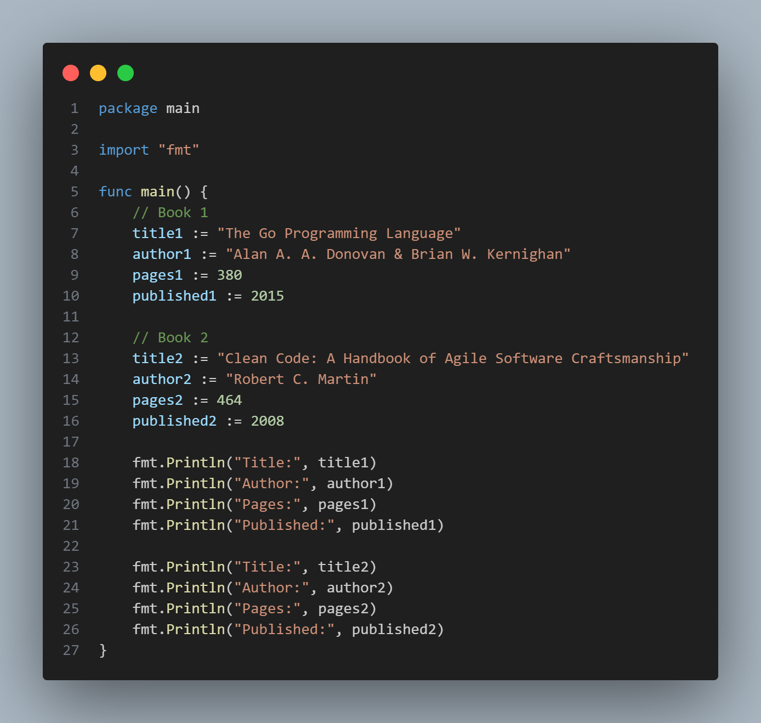

## Introducing Structs

Let’s extract the common fields. 

We can see they are title, author, pages, and published:

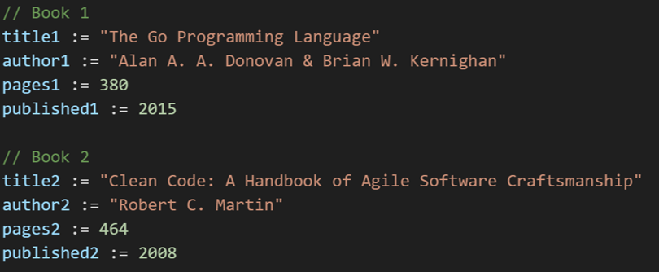

Now let’s create our own data structure, or struct:

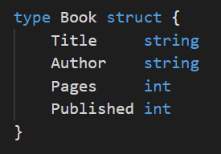

A struct is declared using the `type` keyword, then the name of the struct – here we have called it `Book` – and the keyword `struct`.

Then we can declare the fields (Title, Author, Pages, Published)

## Anatomy of a struct

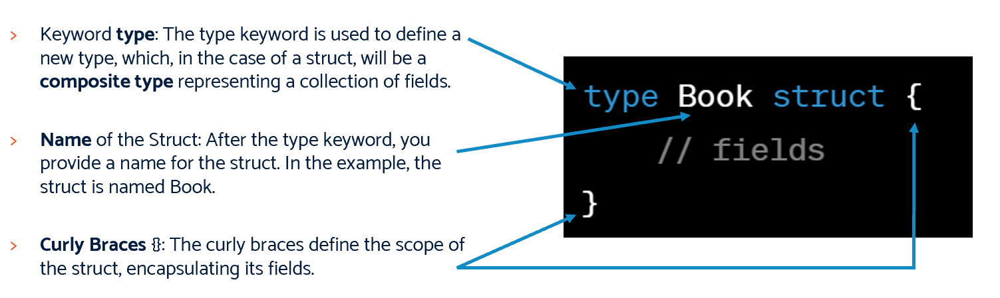

### Fields

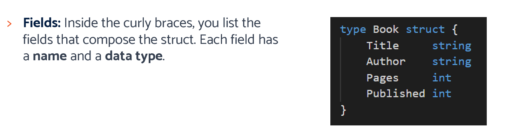

Now come the fields. This is how we will store our data related to the book. You can think of them as variables inside the Book struct.

The Book struct is a `composite data type`.

#### Composite Data Types

What do we mean by composite data type? Well, notice that we have string and integers? We have combined two *primitive* data types to create a more complex type.

Title, Author, Pages, and Published are the fields of the Book struct, whilst string and int are the data types of these fields, respectively.

## Using a struct
Structs are used to create instances, also known as `objects` or `struct literals`. 

An instance is an actual occurrence of the struct, with specific values for each field.

So below, you can see we create an *instance* of the `Book` struct and assign it to the *variable* `goBook`:

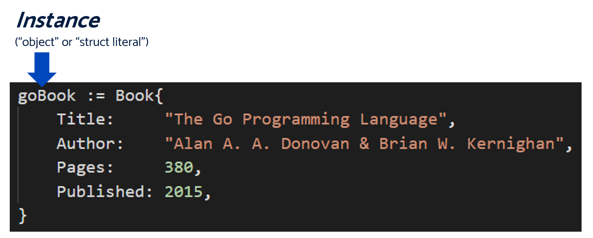

## Wait, what? Instances? Objects?

Yeah, it can be a bit confusing starting out here. So far you've used *primitive* data types like `int` or `string`. But what you're really been doing is creating an *instance* of that data type and assigning it to a variable.

What we are doing now is creating our own data type (`Book`) which has multiple, mixed data types within it.

### Structs are like blueprints

Think of a struct as a blueprint for something, like a blueprint for a house that defines how the house should be constructed.

### Instances are like actual houses

An instance is like an actual house built using that blueprint. It's a real thing you can use or interact with.

### Fields are like rooms in the house
The fields in a struct are like rooms in a house. Each room (field) has a specific purpose or information.

### Creating an instance is like building a house
When you create an instance of a struct, it's like building a real house based on the blueprint. You fill in the details (values for each field) to make a unique and usable house (instance).

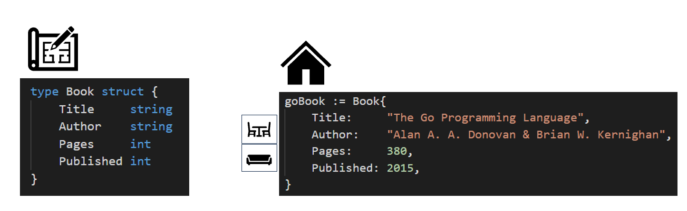

### Accessing fields is like going into rooms
To get information from a struct, you access its fields using *dot notation*. It's like going into a room in the house to see what's inside.

Below you can see we can access the fields of the struct by using the variable we assigned our instance to (`goBook`) pressing "." and then tying the name of the field:

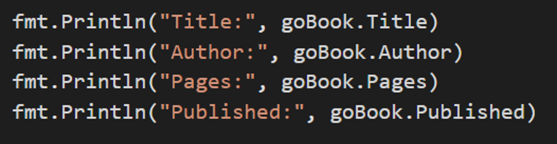

## Lab 1
> Create a new instance of the Book struct, and populate the fields with data. Pick any book you like! 

[Lab 1 link](./lab1/main.go)

## Recap

**Big idea**: group information that belongs together

Example person:
- Name
- Age
- hairColour

Allows us to group together all the information we need about something.

Data Modelling - figuring out what data belongs together.

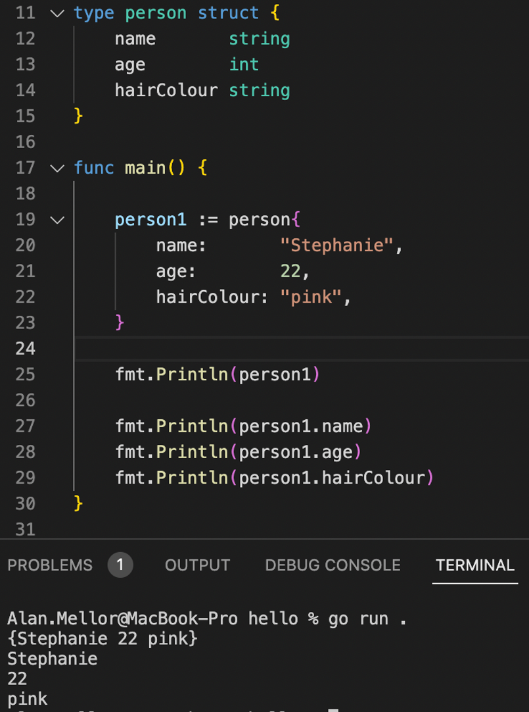

The *dot operator* accesses fields inside the struct

Local variable `person1` is an instance of a struct

It has been *initialised* – it is ready for use

`person1.name` – access `name` field in `person1` variable

# More Complex Structs
## Making even bigger building blocks

Person now has a `homeAddress`

`homeAddress` is itself a struct of type `address`

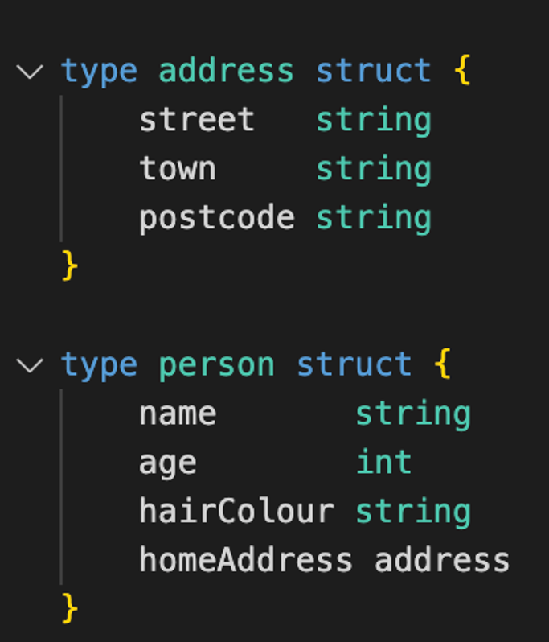

## Lab 2
#### Create a Price struct and add it to Book!

> Create a new struct `Price` which contains 
> - Cost as an integer
> - Currency as a string 

>Now add the Price struct to the Book struct

> Don't forget to initialise it!

> Print out the Cost and Currency
 
[Lab 2 link](./lab2/main.go)

# Slice of Struct
Previously we've created enumerables (arrays, slices) of various primitive data types such as `int` and `string`.

We can use the same techniques with `struct`, because our structs are actually complex data types.

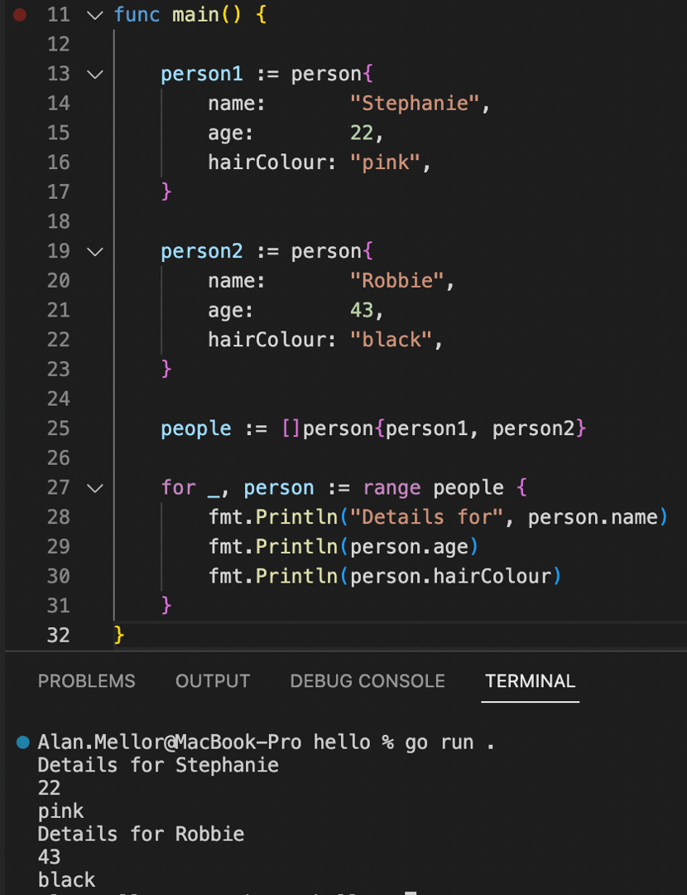

Slice can hold many instances of a struct

Slice `people` holds two `person` instances

Line 27 ranges over each element of the slice

- It is just a loop really

# Lab 3

## Build a recipe book application
Requirements:

1. Recipe book must have at least three recipes

2. Each Recipe needs to have a
- name – eg Pizza
- cooking time in minutes – eg 10
- key ingredient eg “cheese”
- Star rating – eg *****

3. Ask 'user' for the key ingredient *(NOTE: You'll do this through code calling the function, not getting input from the command line!)* and display all recipes containing that ingredient

Bonus Points:
Move ingredients to a separate struct, and allow a search on any of the listed ingredients, eg cheese, tomato, bread dough

[Lab 3 link](./lab3/main.go)